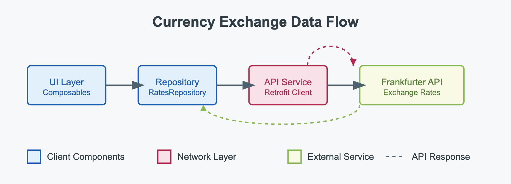

## Description
This application is a currency exchange converter that allows users to convert monetary values between different currencies using real-time exchange rates. The app features a simple user interface built with Jetpack Compose, where users can input a base currency (USD), a target currency (EUR), and the amount they want to convert. 

When the user taps the "Get Rate" button, the app makes an asynchronous API call to the Frankfurter currency exchange rate service using Retrofit, retrieves the current exchange rate for the specified currencies, performs the conversion calculation, and displays the result on the screen with proper formatting. The application follows modern Android development practices with a clean architecture that separates network calls, data handling, and UI components.

## App Architecture

## App Objectives

- Fetch current exchange rates from the Frankfurter API service 

- Calculate and display the converted amount with proper formatting

- Demonstrate modern Android development practices, including:

    - Clean architecture with separation of concerns

    - Jetpack Compose for UI implementation

    - Retrofit for network operations

    - Kotlin coroutines for asynchronous processing

    - Repository pattern for data handling